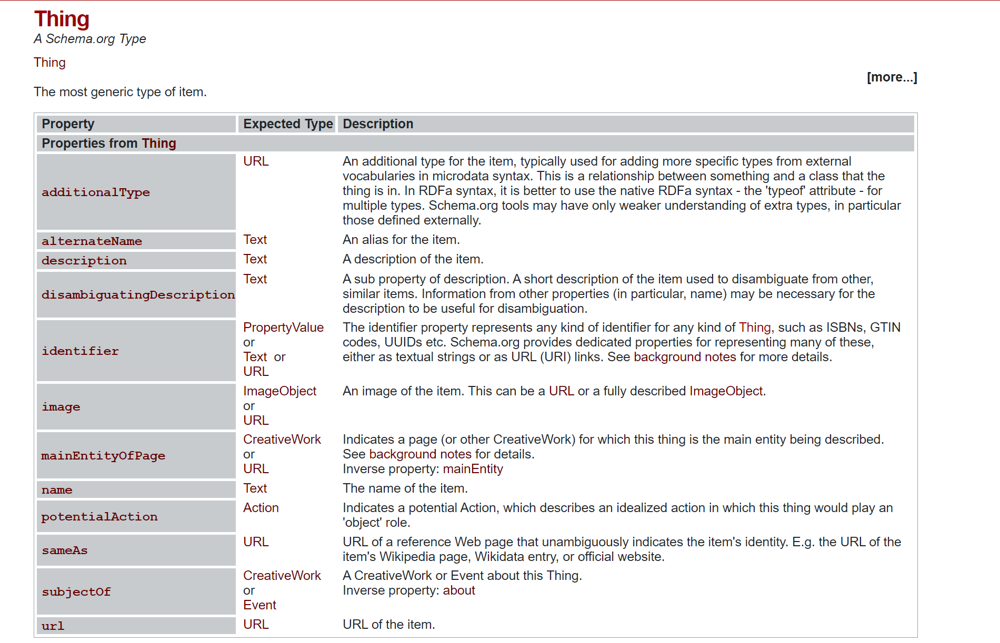
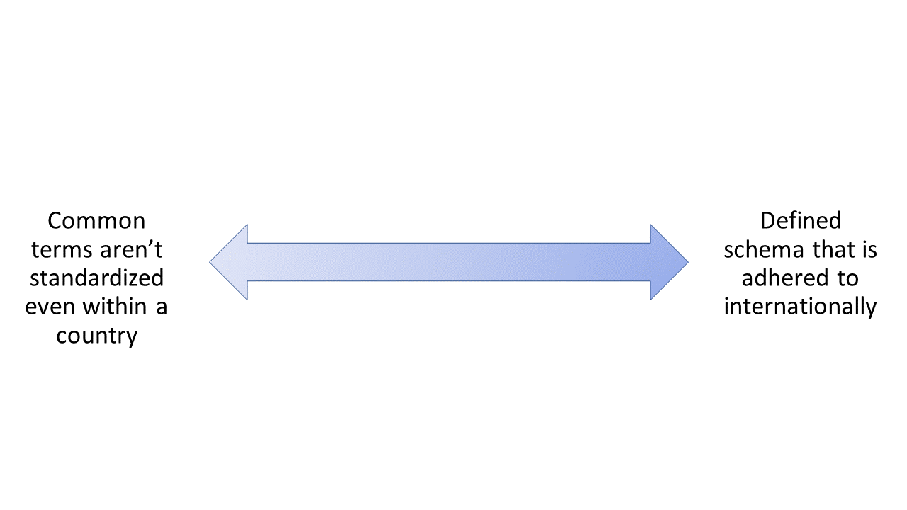
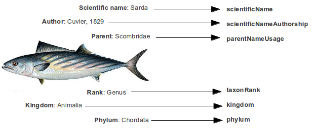
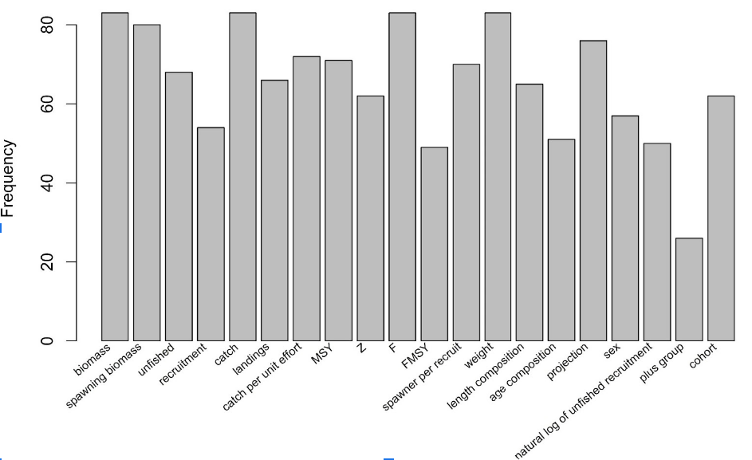
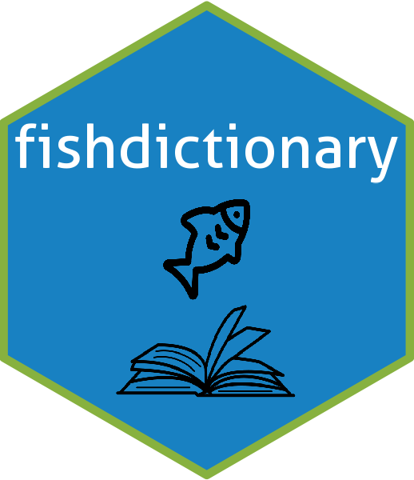
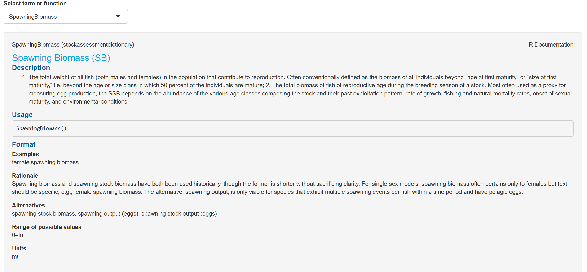
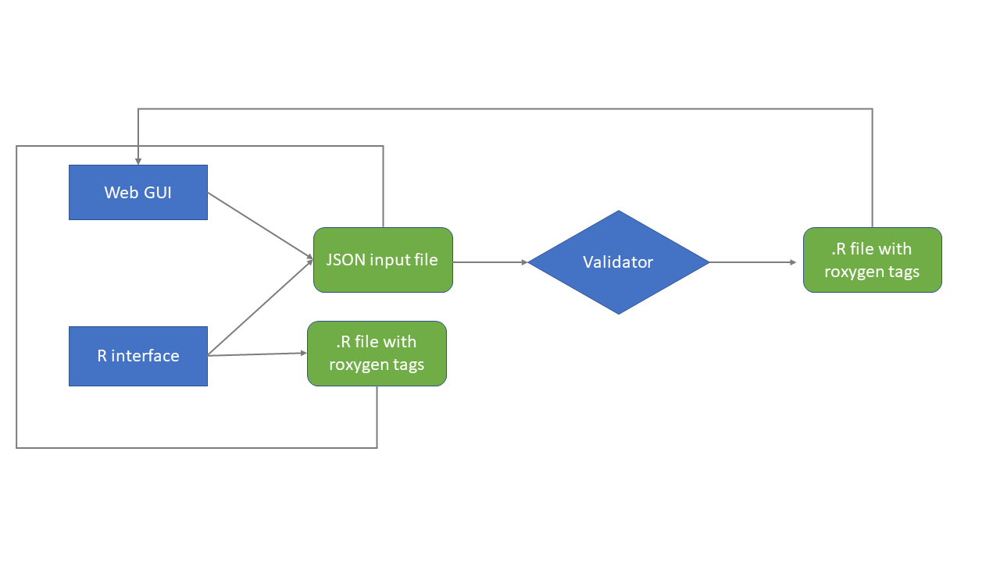

layout: true

.footnote[U.S. Department of Commerce | National Oceanic and Atmospheric Administration | National Marine Fisheries Service]


```{r setup, include=FALSE}
options(htmltools.dir.version = FALSE)
require(here)
require(dplyr)
require(tidyr)
require(ggplot2)
```

```{r xaringan-tile-view, echo=FALSE}
# this gives you a tile navigation if you type "O" at any time
xaringanExtra::use_tile_view()
```
---
# Shift to bring data science tools and workflows into science

```{r openscapes, echo=FALSE, out.width="600px", fig.align='center'}
knitr::include_graphics("./static/pictures/openscapes.png")
```
.footnote[Lowndes et al. <br><br>]

---
# However, workflow standardization is needed to utilize the tools

* The tool is one step of a workflow

```{r dataone, echo=FALSE, out.width="500px", fig.align='center'}
knitr::include_graphics("./static/pictures/dataone.png")
```

.footnote[Find citation <br><br>]

---
# Protocols and schema 
.pull-left[
```{r htpp, echo = FALSE, out.height = "200px"}
knitr::include_graphics("./static/pictures/http.png")
```
]
.pull-right[
```{r schema, echo=FALSE, out.height = "200px"}

```
]

Web technologies have advanced so quickly in part due to standard formats and structures.

---
# We are a long way from this in fisheries

.pull-left[
```{r andre, echo=FALSE}
knitr::include_graphics("./static/pictures/Andre_portrait_FINAL_SCAN.jpg")
```
]
.pull-right[
.hand-blue[
"There's no common method or definition for what a projection is." Andr&eacute;, in August 2022
]
]

---
# In other words..

```{r echo=FALSE, out.height="500px"}
knitr::include_graphics("./static/pictures/standards_2x.png")
```


---
# A step in the right direction

```{r, echo=FALSE, out.height="400px"}

```


---
# This is not a new idea
* NMFS glossary [Blackhart, Stanton, and Shimada, 2006](http://www.st.nmfs.gov/st4/documents/F_Glossary.pdf)
* ICES [DATSU](http://datsu.ices.dk/web/selRep.aspx)
```{r, echo=FALSE, out.height="400px"}

```


---
# Total use across 20 terms
```{r texttotal, echo=FALSE, out.width="800px"}

```
The x axis shows terms that were pre-identified as commonly used and sometimes ambiguous terminology.


.footnote[Wetzel et al. In internal review. <br><br>]
---
# Use across NOAA Fisheries science centers

```{r textanalysis, echo=FALSE, out.width="700px", fig.align='center'}
knitr::include_graphics("./static/pictures/baichart.png")
```
The x axis represents alternative text representations of the same term (e.g. CPUE, catch per unit effort).


.footnote[Wetzel et al. In internal review.]

---
# {fishdictionary} an `R` package 

```{r echo=FALSE, out.width="400px", fig.align='center'}

```


.footnote[Wetzel et al. In internal review. <br> <br>]

---
# An entry

```{r, echo=FALSE, out.width="600px", fig.align="center"}

```

---
# Uses a common file format with a validator in JSON

```{r validator, echo=FALSE, out.width="600px", fig.align="center"}

```


---
class: middle

# https://github.org/nmfs-fish-tools/fishdictionary


---
# Increasing coordination and interdisciplinarity

* Gives a common language across silos and disciplines
* Rise of code and tool sharing across the US
* We are creating a platform but need others to help populate it!

---
# Next steps

* Adding an entry via the web application
* Search and filtering
* What is the peer review process for dictionary entries?
* Synergy with international standardization efforts
* What would help you contribute?