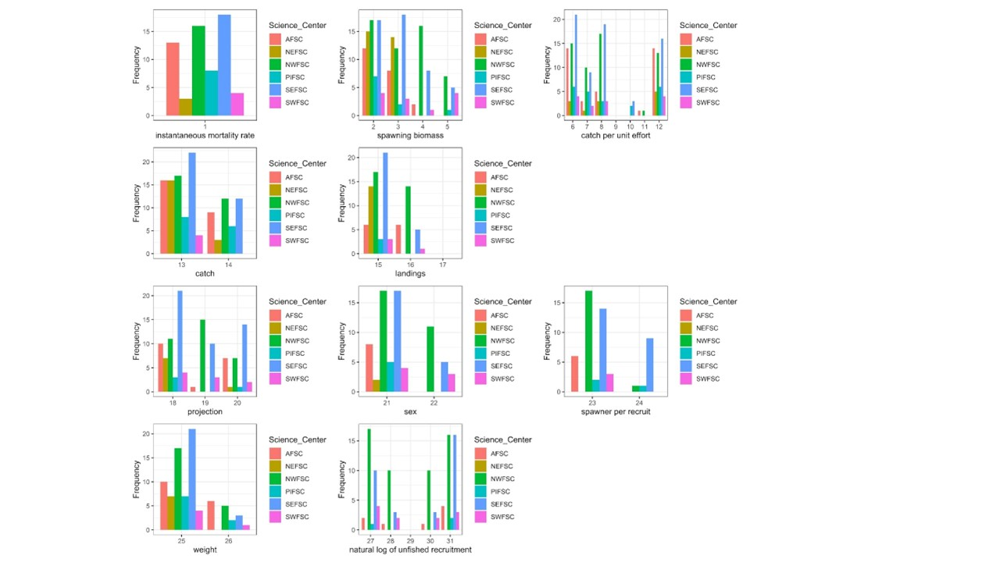

layout: true

.footnote[U.S. Department of Commerce | National Oceanic and Atmospheric Administration | National Marine Fisheries Service]


```{r setup, include=FALSE}
options(htmltools.dir.version = FALSE)
require(here)
require(dplyr)
require(tidyr)
require(ggplot2)
```

```{r xaringan-tile-view, echo=FALSE}
# this gives you a tile navigation if you type "O" at any time
xaringanExtra::use_tile_view()
```
---
# Shift to bring data science tools and workflows into science

These tools promise better science in less time

Facilitate remote collaboration

Reproducibility and fixing the retirement problem

```{r openscapes, echo=FALSE}
knitr::include_graphics("./static/pictures/openscapes.png")
```

---
# However, these tools have limited promise without standardization

Difficult to transfer tools to new locations/species/computer architectures

Manual steps in data-pre-processing cannot be performed by computers


---
# Protocols and schema 
.pull-left[
```{r htpp, echo = FALSE, out.height = "200px"}
knitr::include_graphics("./static/pictures/http.png")
```
]
.pull-right[
```{r schema, echo=FALSE, out.height = "200px"}
knitr::include_graphics("./static/pictures/schema.png")
```
]

If you are sending data over the web, you're using a protocol. Any big data scheme that is used in data science workflows typically adheres to a schema, written in a markup language like json.

---
# Where we are right now in fisheries

"There's no common method or definition for what a projection even is." Andre, in August 2022

---
# Theres a big gap between where we are and where we want to go
This is not a panacea but a step in the right direction

---
# Others have taken steps in the right direction

---
# Bai's text analysis
Assembled a corpus of stock assessment documents produced by Science Centers or International Organization: Alaska Fisheries Science Center, Northeast Fisheries Science Center, Northwest Fisheries Science Center (NWSC), Pacific Island Science Center (PISC), Southeast Fisheries Science Center, Southwest Fisheries Science Center (SWFSC), Inter-American Tropical Tuna Commission (IATTC), International Commission for the Conservation of Atlantic Tunas (ICCAT), Joint Technical Committee (JTC) of the Pacific Hake/Whiting Treaty, and Western and Central Pacific Fisheries Commission (WCPFC).

---
# Total use across 20 terms
```{r texttotal, echo=FALSE, out.width="800px"}
knitr::include_graphics("./static/pictures/summedacross.png")
```
The x axis shows terms that were pre-identified as commonly used and sometimes ambiguous terminology.


.footnote[Wetzel et al. In internal review.]
---
# Use across NOAA Fisheries science centers

```{r textanalysis, echo=FALSE, out.width="800px"}

```
The x axis represents alternative text representations of the same term (e.g. CPUE, catch per unit effort).


.footnote[Wetzel et al. In internal review.]

---
# Introduce the R package and schema

.footnote[Wetzel et al. In internal review.]

---
# What an entry looks like


---
# JSON validator

We can use 

---
# Shiny app
https://connect.rstudio.noaa.gov/fishdictionary

---
# Next steps


---
# Open questions
* What is the peer review process for a dictionary?
* Package maintenance
* 